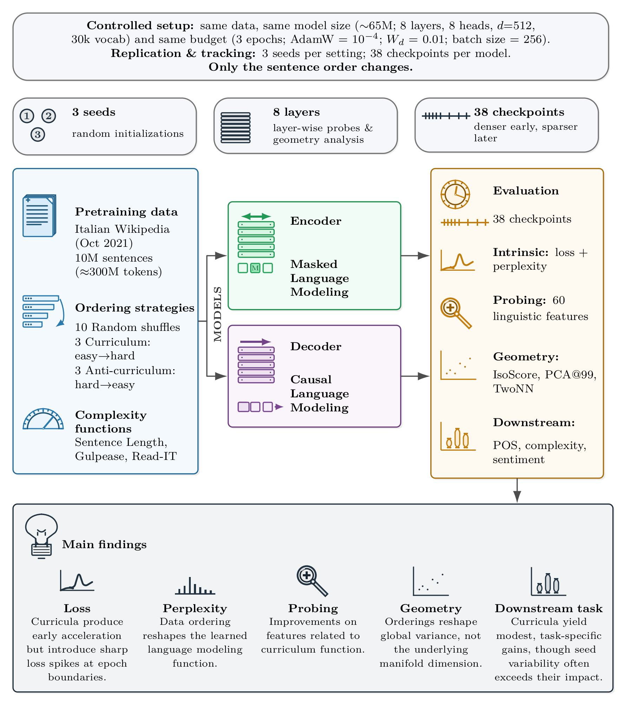

# On the Impact of Pretraining Data Ordering in Transformer Encoder- and Decoder-only Language Models

**Accepted at Knowledge-Based Systems (2026)**  

**Authors:**  
- Luca Dini  
- Dominique Brunato  
- Felice Dell'Orletta  
- Lucia Domenichelli  

---

## 📌 Overview

This repository contains the code and experimental setup for the paper:

> *On the Impact of Pretraining Data Ordering in Transformer Encoder- and Decoder-only Language Models*

The project investigates how different **data ordering strategies** affect the pretraining dynamics and the learned representations of Transformer-based language models.

We compare **complexity-based curricula** against **random orderings**, analyzing their impact across multiple evaluation dimensions.

---

## 🧠 Models

We consider two Transformer architectures:

- **Encoder-only model** (BERT-style)
- **Decoder-only model** (GPT-style)

Both models are trained under identical conditions, varying only the **data ordering strategy**.

---

## 📚 Curricula

We experiment with the following data ordering strategies:

### 🔀 Baselines
- **5 Random orderings**

### 📈 Complexity-based curricula
- **Sentence Length** (proxy for structural complexity)
- **Gulpease Index** (readability metric for Italian)
- **READ-IT** (linguistically-informed readability metric)

Each curriculum is also evaluated in its **reverse ordering** (from complex to simple).

---

## 🌱 Training Setup

To ensure robustness, each experiment is repeated with multiple random initializations:

- Seed 42  
- Seed 995  
- Seed 755  

---

## 📊 Evaluation

We evaluate models along multiple complementary dimensions:

### 🧪 Downstream Tasks
- **Part-of-Speech Tagging**  
- **Human Complexity Judgment**  
- **Sentiment Analysis**

### 📉 Training Dynamics
- **Perplexity trends during training**

### 🧬 Representation Analysis
- **Embedding structure and geometry**

### 🔍 Linguistic Probing
- **Probing tasks targeting specific linguistic properties**

---

## 🖼️ Graphical Abstract

